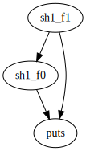

# bin_tools

call_graph_generation tool on binary file. Generally, misc for reverse engineering.

## Call graph generation tool

### usage

```
./call.o -g "ex/libcc1.so"
```

-g means generate.
-e means attaching new elf section.

.so can be any executable file if it is elf format.

You will see .dot format file after it is properly recognized.

After you converted to svg, you will see a call graph.



### Basic idea (case of elf format targeting x86)

The underlying idea is detecting call instruction skimming through .text area of object format file, and generate call graph. You can also attach call graph dependency information as a new section on the input object format file.

When it is on a sequence of instruction, it checks "e8" & subsequent 4byte(candidate operand) meaning relative address from %rip. You might think, "Wait, there are lots of "e8" which are used for other purposes as operands which follows another opcode in X86.". Yes, indeed, but if you have to write a very long switch statement for this task, that is far from my desire. And here comes an idea. If you notice that you can collect heads of every function including the ones on plt, address that the functions are allowed to be jumped on is pretty limited. If you found "e8" and subsequent 4byte + %rip is one of them, it is very likely to be jump instruction. 

### Procedure

It first gets symbol table or dynamic symbol table and guess where is the offset of each fucntion on .text area. You need to take a look at .rela section as you cannot find any offset address to the function defined on procedure linkage tableon symbol table.

Every functon on PLT is the bottom node since the function is going to be linked later on in this current scheme.

#### Target object format file

- elf (current target)
- windows PE and Mach-o will be next target.

### Target assembly

- x86 (so far only: relative near call)
- arm (intended)

### Future extension

c++ (argument & type can be extracted)

### Section format for function-call-table

In order to describe function-call dependency in a compact mannner,
call graph section format consists of a list of entries, and each entry
tells us a-to-multiple (callee-to-its callers) dependency of a funcion.
Each entry holds two parts.

1. Fixed-length header

2. List of names of caller function

The size of fixed length header is 16byte.

Format of fixed-length header is as follows.

```

typedef struct {
  Elf64_Addr addr;
  Elf64_Word st_name;
  Elf64_Word length;
} call_table;

```

* addr(8byte) :: relative address of the function, setting its offset from beginning of elf header.
* st_name(4byte) :: index of string table

* length(4byte) :: length of caller functions that the function calls

Following part is st_name of caller functions.

The size of the list of caller function names is always multiples of 16byte for simplicity of reading its byte.

Length on call_table on header is not multiples of 16byte, but actual numbers of callers.

That means, the entities whose index is moduler of 4 is kept as blank. For example, If there is one caller function, rest of 3(x4byte) is filled in with setting its value 0.

Note that this section depends on symbol table section & string table section.

### Caution

Still under development.
